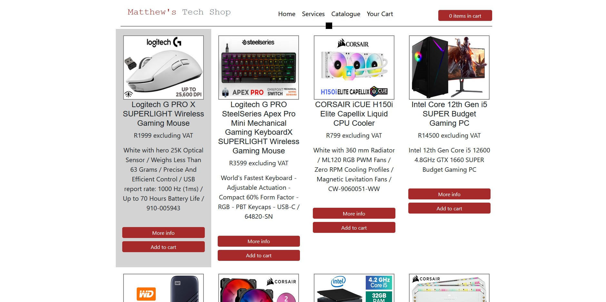
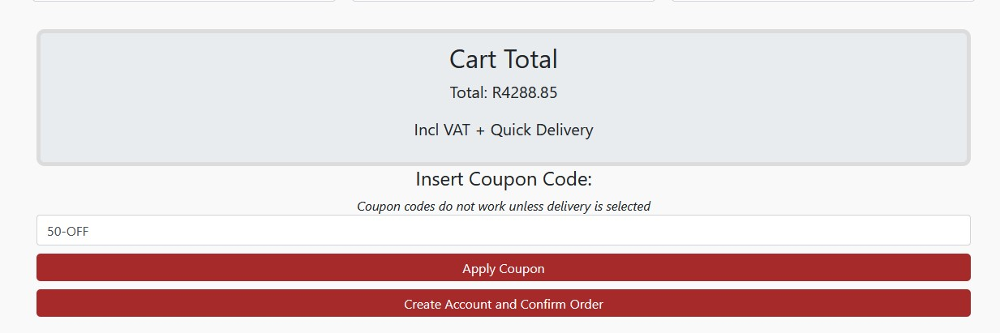
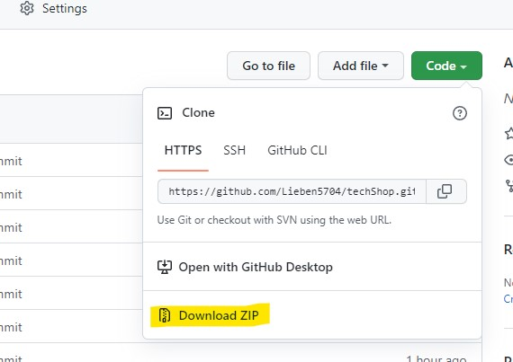

# Capstone Shop - L2T05 Compulsory Task 2

### 1. Project Description

_This project is a tech shop with a home page, services page, catalogue page, and a cart page. The products are created using **Javascript constructors**, 
and the functionalities of all buttons and the cart page are also mainly done in JS and Jquery. All styling has been done using **HTML, CSS and Bootstrap**._

### Table of Contents
1. Project description
1. Usage
1. Installation
1. Credits

## Usage
### Home Page
_On the home page, you will find a **responsive accordion** giving you some details about the shop and what services/products are offered. 
There is also a section where you can find **customer reviews** as well as a button linking to a **references** page._

Languages: **HTML, CSS, Jquery and Bootstrap**

### Services Page 
_On the services page there is a **table of services** offered, as well as pricing for these services. 
On this page you can also find **contact details**, and a link for more information_

Languages: **HTML, CSS and Bootstrap**

### Catalogue Page
_Here you will find a series of **products offered** by the shop. You have the option of viewing **more information** about each product, or **adding the product to your cart**.
The product description gives you the **name, short description** and **price** of the product, as well as an **image**._

Languages: **HTML, CSS, JavaScript, Jquery and Bootstrap**

### Product Pages
_On each product page you can find an **image, description, price and additional information** about each product. 
These pages are **informational** and have very few functionalities._

Languages: **HTML, CSS and Bootstrap**

### Cart Page
_The Cart Page and the Catalogue Page are the most complex in this project. On the cart page, **calculated totals and subtotals** are shown, and you have the option of **creatring
an account**, adding **coupon codes**, selecting **delivery options** etc. On  top of this, you can also **view which products you currently have in your cart**._

Languages: **HTML, CSS, JavaScript, Jquery and Bootstrap**

## Installation

_In your **terminal**, use the following command to download the repository content:

**git clone https://github.com/Lieben5704/techShop.git**

OR alternatively you can download the ZIP file_

## Credits
The autor of this project is: **Matthew Liebenberg** 

_You can also find a list of information references on the Home Page._
